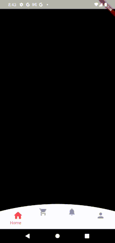

# Curved Bottom Navigation Bar with Animations

A Flutter package for a modern, curved bottom navigation bar with customizable animations, icons, labels, and styles. Perfect for enhancing the user experience with smooth transitions and visually appealing designs.

## Features

- **Curved Design**: A sleek, curved navigation bar for a unique UI.
- **Custom Animations**: Smooth scaling, shaking, and color transitions for selected items.
- **Full Customization**: Customize icons, labels, colors, and fonts to match your app's theme.
- **Animation Toggle**: Disable animations if you prefer a simpler UI.
- **Flexible Navigation**: Easily manage screens and items with the provided API.
- **Responsiveness**: Adapts seamlessly to various screen sizes.

## Preview



## Installation

Add this package to your Flutter project by adding it to your `pubspec.yaml` file:

```yaml
dependencies:
  curved_bottom_navigation_bar: ^0.0.7
```
Then, run:
`
flutter pub get`

Import the package into your Dart file:

` 'package:curved_bottom_navigation_bar/curved_bottom_navigation_bar.dart';
`
## Usage
### Example Code

Here’s an example of how to use the CurvedBottomNavigationBar widget in your app:

```import 'package:curved_bottom_nav_animations/curved_bottom_nav_animations.dart';
import 'package:flutter/material.dart';

void main() => runApp(const MyApp());

class MyApp extends StatelessWidget {
  const MyApp({Key? key}) : super(key: key);

  @override
  Widget build(BuildContext context) {
    return MaterialApp(
      home: Scaffold(
        body: CurvedBottomNavigationBar(
          selectedIndex: 0,
          onItemTapped: (index) {
            print("Tapped on item: $index");
          },
          icons: [Icons.home, Icons.search, Icons.notifications, Icons.person],
          labels: ['Home', 'Search', 'Notifications', 'Profile'],
          screens: [
            Center(child: Text("Home Screen")),
            Center(child: Text("Search Screen")),
            Center(child: Text("Notifications Screen")),
            Center(child: Text("Profile Screen")),
          ],
          backgroundColor: Colors.blue,
          selectedIconColor: Colors.white,
          unselectedIconColor: Colors.white70,
          selectedItemFontStyle: TextStyle(fontSize: 14, color: Colors.white),
          unselectedItemFontStyle: TextStyle(fontSize: 12, color: Colors.white70),
        ),
      ),
    );
  }
}
```